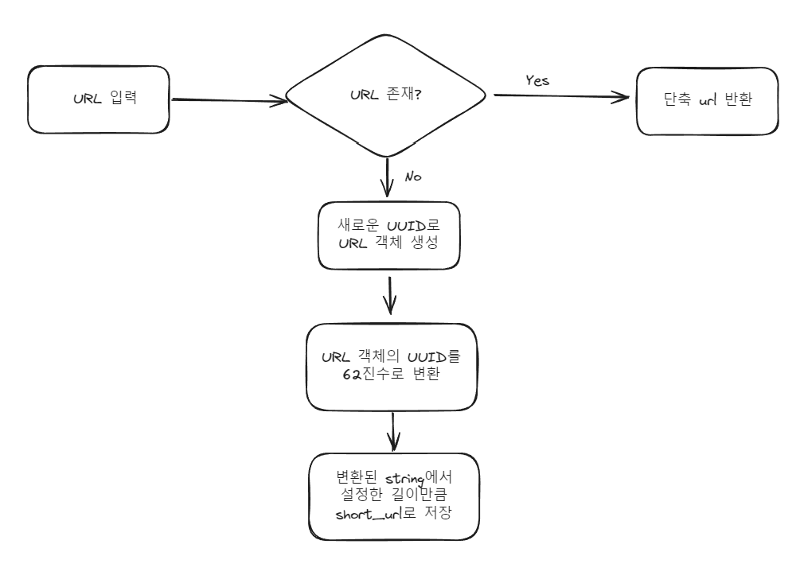

## 단축 URL 순서도



## 데이터베이스 선택 이유
- redis와 같은 key-value 형식의 In-memory 데이터베이스: 메모리의 가격이 비싸기 때문에 많은 유저 수를 생각하면 비용이 커질거라 생각하여 배제
- RDBMS / NoSQL: 데이터의 중복(short_url)을 방지하기 위해 RDBMS를 사용하는 것이 낫다고 판단
- uuid를 URL 테이블의 id로 사용하여 전역적 유일성을 보장하고(사용자가 늘어나 데이터베이스가 분산된 환경에서도 고유할 수 있도록), 해당 id를 62진수로 변환하여 단축 URL 생성
- 일반적인 1부터 1씩 더해가며 시작하는 id를 62진수로 변환하여 단축 URL을 생성 시, 다음 id의 URL을 파악하기 쉽기 때문에도 uuid를 사용하는 것이 낫다고 판단.

# 설치 및 실행
```
# git 레포지토리 클론
git clone https://github.com/omognuni/mementoai.git
cd mementoai

# docker image 빌드 및 실행
docker compose up -d --build
```
# 테스트
- 실행 후 다음 명령어 실행
```
docker compose run --rm qs sh -c 'pytest app'
```

# Swagger 문서
- localhost:8000/docs
